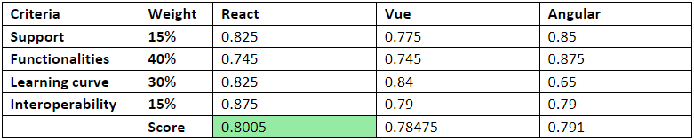
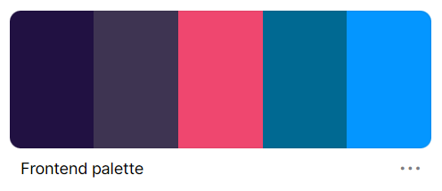
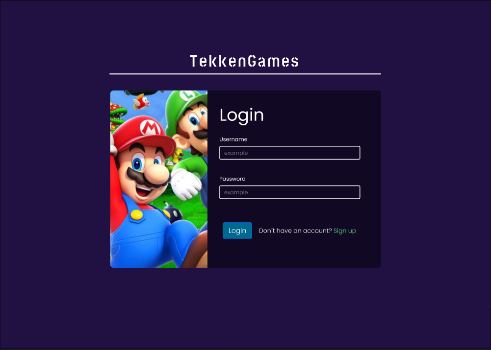
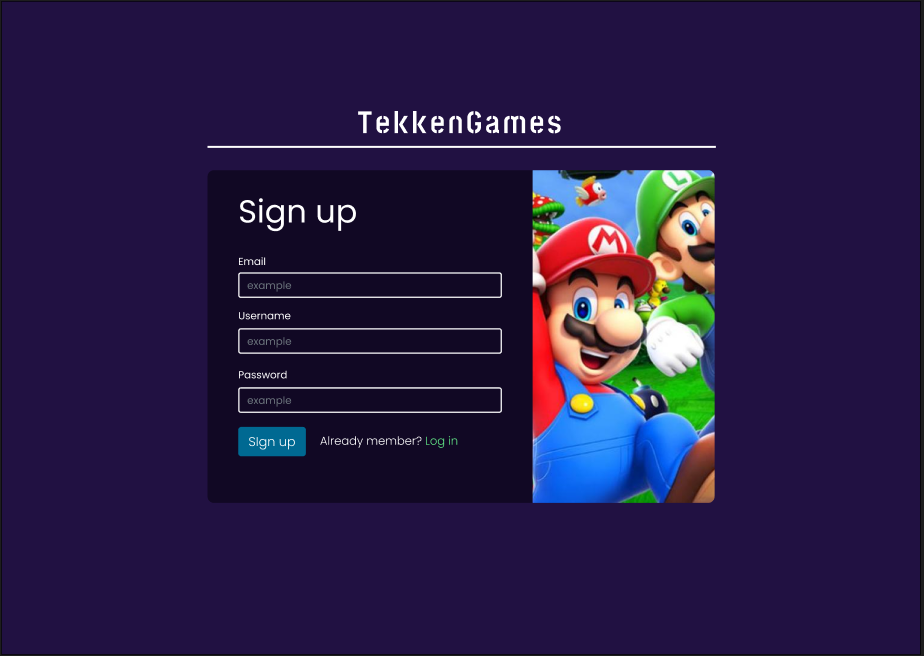
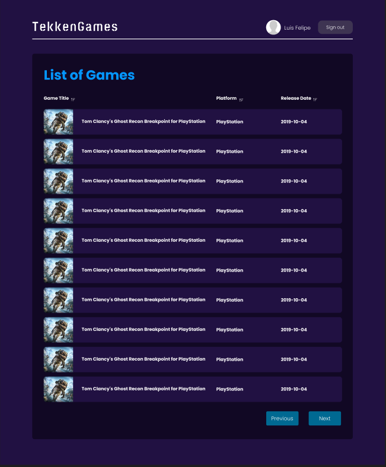
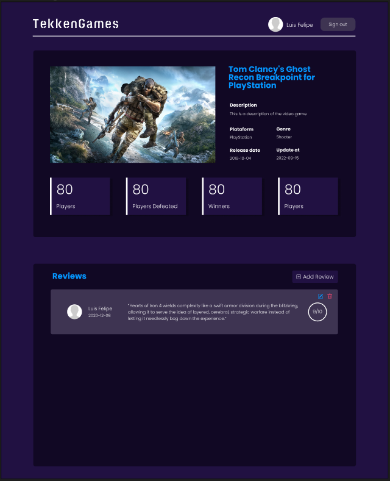
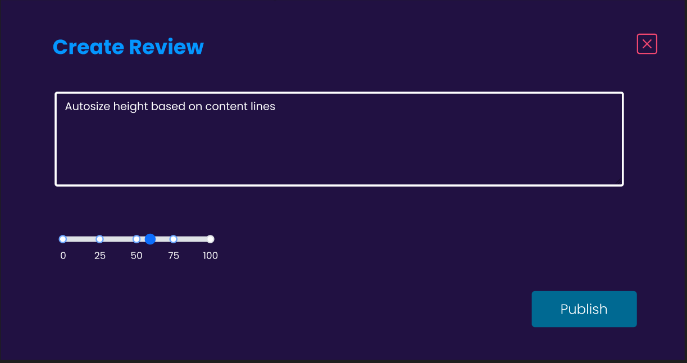
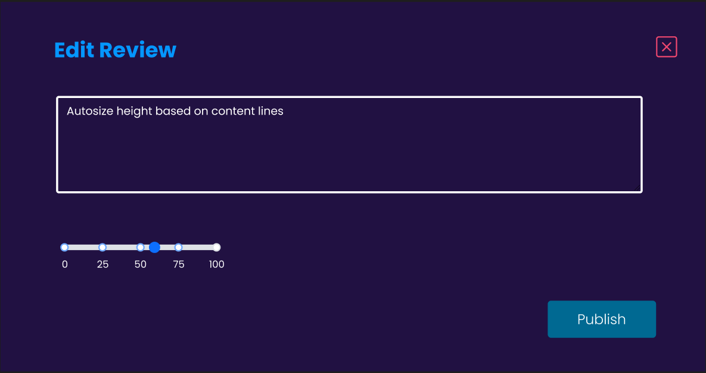
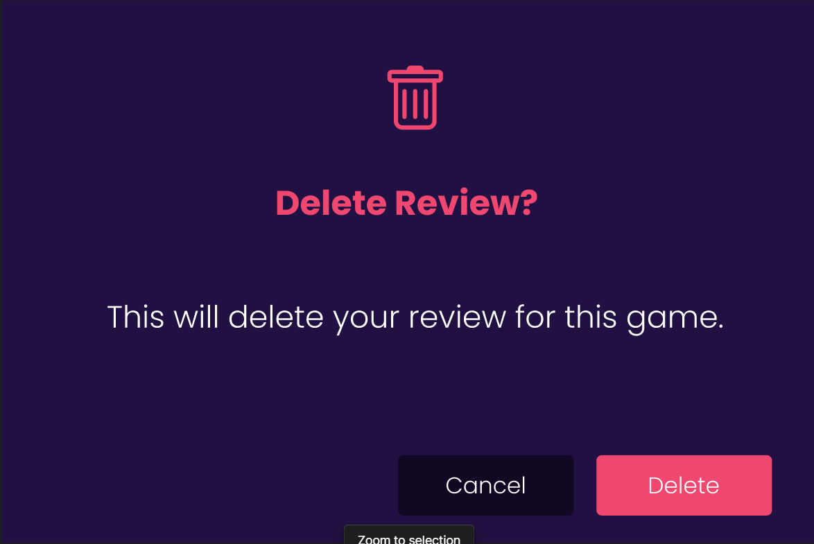
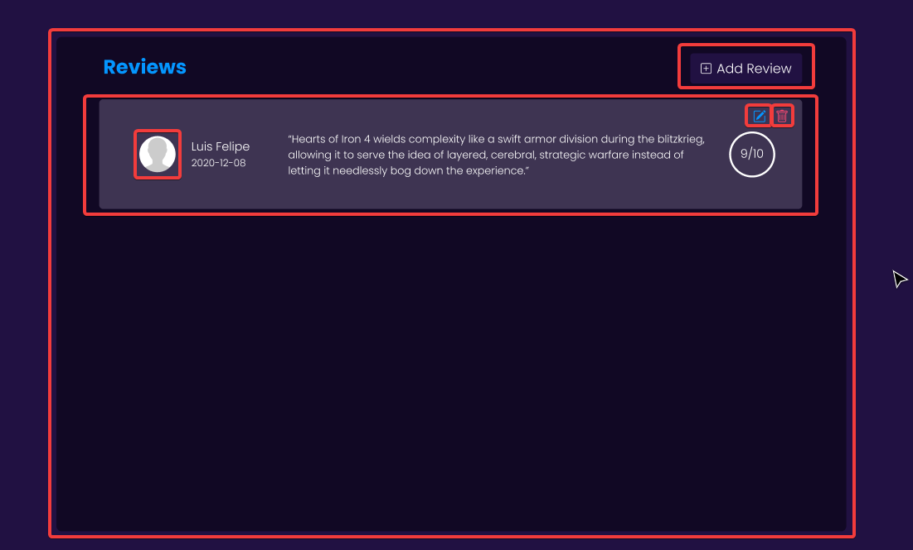

# Community Game Frontend 
 
This repository contains our solution to the Frontend challenge using the concepts covered in the training. 
 
## Challenge details 
 
One of Endava's new customers is a video game review website. As part of the front-end development team they need to create the MVP with the following features: 
 
* Sign-up view
* Login view
* Logout view
* Grid Listing game data
* Show one game 
* Create/Update a game review
* Delete a game review
 
## Problem analysis
 
For the development of the challenge, we first considered which frontend framework or library we would use. For this, we took into account four weighted qualification criteria:
 
* **Support:** The organizations currently using the library, such as Google, Facebook, Uber, and others. The number of people who contributed to the framework or library repositories. The number of solved issues compared to the number of open issues. Weight 15%.

* **Functionalities:** For the functionalities, consideration was given to how client-side routing needs to be implemented, how the library offers component reusability, and how to implement protected routes. Weight 40%.
 
* **Learning curve:**  We considered how much we knew about the technology. Also, the effort to learn how to implement new functionalities. Weight 30%.
 
* **Interoperability:** For this, we took into consideration if the library or framework could be easily extendable with external libraries for facilitate the development of features as the styles and games grid, since there are libraries/frameworks that depend on either JavaScript or TypeScript. Weight 15%.
 
Each of these criteria had a weight and a qualification. Both of us gave a qualification between 0 and 1. The higher the rating implies that the library meets the criteria and/or facilitates the implementation of the new front end. Of these ratings, the average was obtained. and these averages were weighted up.



Given the above analysis the chosen library was react. We had some knowledge about react. Also, it is supported by Facebook and used by Atlassian, Netflix, UberEats and other companies. It is easily extendable to obtain the functionalities needed, there is greater compatibility with other libraries, given that React accepts JavaScript and TypeScript as code base.

### Other libraries

* **Bootstrap:** It facilitates application layout design and component creation, and we use **react-bootstrap** components and the library's default classes for flexibility. We chose it considering our knowledge and the time that was given for the challenge.
* **Sweetalert2:** It allows us to give the user feedback on the events occurring in the application in a simple way. It is a declarative library that has default styles that speed up development.
* **Ag Grid:** Library that facilitates the development of the game grid as it provides a React component with events for data handling operations such as sorting and fetching from the backend. Other libraries such as Muuri and Tabulator were considered, but the React component of the library either did not work correctly or did not have official support for the latest React version.

## Mockup designs
Given the client's requirements, it was designed app view mockups with the required functionality in mind, these mockups were implemented in Figma ([TekkenGames](https://www.figma.com/file/cCVKKdozCL67ud1Vou3eOB/Frontend-mockups?node-id=0%3A1)) and the [color palette](https://coolors.co/palette/211142-3e3452-ef476f-006992-0496ff) for the application was chosen in coolors.io. The dark colors were chosen given the trend shown in other applications such as Steam, Epic Games Store, and RAWG.

* **App palette:**



* **Mockups:**









# Implementation

We define which components we implement in the application taking into account the mockups. In the example of the reviews list the following components were defined:



Each component is enclosed in a red rectangle.


# Installation & Usage

## Prerequisites

* **[Node](https://nodejs.org/en/)**: v16.17.1 
* **[npm](https://www.npmjs.com/)**: v8.15.0
* **[Git](https://git-scm.com/)**
* **The backend project [CommunityGameBackend](https://github.com/SpringBootChallenge/CommunityGameBackend)**.

## Clone the repository

```
git clone https://github.com/SpringBootChallenge/CommunityGameFrontend.git
```
## Install the dependencies
```
 npm install
```

## Run the backend project

The application needs the backend project [CommunityGameBackend](https://github.com/SpringBootChallenge/CommunityGameBackend) running on `localhost:8080`.

## Install the application
```
 npm start
```
This will run the application on `localhost:3000`.

## Run tests

```
 npm test
```

# Authors
* **Laura Valentina García** - [Github](https://github.com/laura-gar) 
* **Juan David Valencia** - [Github](https://github.com/juanvalag2019)
